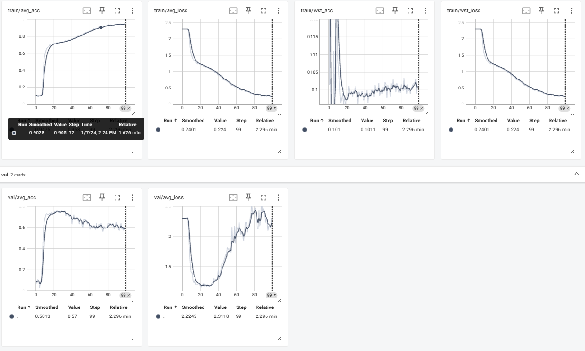
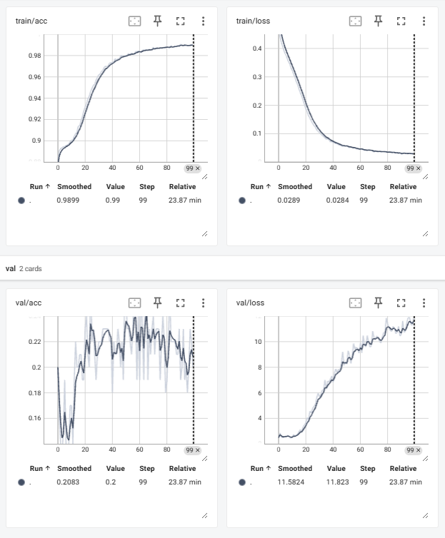

# Report for AAI Project: Train classifier for modified MNIST with unstable (spurious) features

- Members: 陈昆秋(Kunqiu Chen), 周一凡(Yifan Zhou)
- SID: 12332426, 12332419
- Date: 2024-01-06
- [GitHub Repository](https://github.com/edalring/AAI-Final-Project/tree/main): https://github.com/edalring/AAI-Final-Project/


## Project Analysis

### Domain
This project is about invariant learning in DL. 

### Goal
We need to eliminate the influence of unstable feature and so on in model training and reasoning.

### Input & Output

- Input: modified MNIST images
  - add noise : assign wrong label to some images
  - add extra unstable/unrelated channels: $28 \times 28$ -> $10 \times 28 \times 28$
    - The real greyscale channel may be one of the 10 channels, others channels are filled with 0s
    - For example, for some training data, the grayscale channel is the first channel, while the grayscale channel in other test data is the seventh channel (of course, it may also be other channel)
- Output: the correct label of the image

### Data Analysis
#### Train Data:
- row index: train label
- colomn index: channel index of greyscale data
- data[i,j] : the number of train data with label i and greyscale channel j

```
 [[5365   54   73   61   67   73   66   46   64   60]
  [  59 5709   70   92   72   75   68   70   80   90]
  [  55   67 5435   80   77   62   61   61   73   72]
  [  66   76   76 5514   70   61   67   90   59   63]
  [  67   63   70   79 5275   65   73   84   59   55]
  [  80   44   55   56   48 4984   55   52   70   63]
  [  74   72   70   66   62   78 5354   60   59   66]
  [  65   67   80   57   63   77   72 5602   76   89]
  [  70   61   60   65   65   73   51   56 5347   63]
  [  74   72   74   60   71   77   55   55   62 5384]]
```

**The greyscale channel distribution of train data almost follows the labels.**

#### Valid Data:
- row index: valid label
- colomn index: index of valid data file
- "-": the valid data file does not exist
- data[i,j] : the greyscale channel index of valid data with label i and index j

```
[[ 0  0  6  2  3  3  6  -  -  -  -  -  -  -  -  -]                                                
 [ 5  7  5  0  6  1  1  4  8  3  -  -  -  -  -  -]
 [ 6  5  1  6  0  5  0  1  -  -  -  -  -  -  -  -]
 [ 0  6  4  2  6  3  6  -  -  -  -  -  -  -  -  -]
 [ 9  0  3  7  2  0  7  1  7  3  6  4  -  -  -  -]
 [ 3  7  2  9  3  5  0  5  3  3  7  8  -  -  -  -]
 [ 1  9  8  3  9  5  9  7  3  3  -  -  -  -  -  -]
 [ 6  3  1  0  0  3  1  3  1  2  9  8  9  7  7  2]
 [ 7  5  9  -  -  -  -  -  -  -  -  -  -  -  -  -]
 [ 7  5  9  9  8  4  4  9  1  5  7  2  5  2  3  -]]
```

**Obviously, the greyscale channel distribution of valid data is different from train data.**


#### Test Data:

- Greyscale channel distribution of test data is uniform.
  - `greyscale_channel_count[i]` : the number of test data with greyscale channel `i`
  ```Python
  greyscale_channel_count = [935 1037  980  989 1028 1018  946  983 1013  971]
  ```

- Top 25 test data
  - check `0.npy`, `1.npy`, .... , `24.npy`
  - greyscale data channels: `[7 6 9 0 7 8 3 4 6 8 0 7 8 4 1 8 7 4 3 5 8 1 6 7 5]`
  - labels (mannual check) : `[6 0 5 4 9 9 2 1 9 4 8 7 3 9 7 4 4 4 9 2 5 4 7 6 7]`


**Obviously, the greyscale channel distribution of test data is different from train data.**


#### Summary for Data Analysis
- The greyscale channel distribution is the unstable feature in this project.
- The greyscale channel distribution of train data almost follows the labels.
- The greyscale channel distribution of valid/test data is random.
- We need to design a method to eliminate the influence of unstable feature in model training, as the distribution of unstable feature is different between train data and valid/test data.


## Methodology for Invariant Feature Learning


### [Tofu](https://github.com/YujiaBao/Tofu): the recommended method for invariant feature learning

> Ref:  
>   - Paper: [Learning stable classifiers by transferring unstable features](https://proceedings.mlr.press/v162/bao22a.html)
>   - [Paper guide](https://zhuanlan.zhihu.com/p/581626707)
>   - [Repo](https://github.com/YujiaBao/Tofu)


#### Define

- Different environments: Datasets with different unstable feature distributions.

#### 1. Identify spurious correlations from the source tasks

- Input: `N` different environments (TOFU's MNIST dataset only provided 2 environments)
- Output: `N(N-1) * M * 2` datasets
  - `N`: Number of environments
  - `N-1`: Number of classifiers trained in other environments
  - `M`: Number of classes in the classification task
  - `2`: For classification error or correctness
- Example (`N=2`): 
    ```
    ENV_e0_LABEL_y0_correct
    ENV_e0_LABEL_y0_mistake
    ENV_e0_LABEL_y1_correct
    ENV_e0_LABEL_y1_mistake
    ENV_e1_LABEL_y0_correct
    ENV_e1_LABEL_y0_mistake
    ENV_e1_LABEL_y1_correct
    ENV_e1_LABEL_y1_mistake
    ```
- Process
  1. Train `N` classifier models on `N` environments
  2. For each environment, collect classification results of other classifiers, divide into new datasets based on each label and correctness

- Pseudocode
  ``` Python
  N envs, N models
  train N models on N envs
  for i in range(N):
    env = envs[i]
    for j in range(N):
      if i == j:
        continue
      model = models[j]
      predict = model.predict(env.X)
      label = env.y
      correct = predict == label
      correct_env = env.X[correct]
      mistake_env = env.X[~correct]
      for label in range(M):
        correct_label_env = correct_env[correct_env.y == label]
        mistake_label_env = mistake_env[mistake_env.y == label]
  ```
- Note: The reason for dividing the dataset by label is to ensure each class has an equal number of samples in subsequent training.

#### 2. Learn an unstable feature representation

- Input:  $N \times (N-1) \times  M \times 2$ datasets, a model for representing unstable features
  - $N$: Number of environments
  - $N-1$: Number of classifiers trained in other environments
  - $M$: Number of classes in the classification task
  - $2$: For classification error or correctness
- Output: Model parameters for unstable features, trained using the aforementioned data
  - The model is similar to an encoder, encoding data's unstable features. (In TOFU, this model uses the same CNN + MLP as the classifier)
  - However, the model has two parts: embedding CNN and clf MLP. Here, the embedding CNN part is trained
  - In TOFU, the output of the CNN's embedding part is 300-dimensional

- Formula:

$$
f_Z = \arg \min \sum_{y, E_i \neq E_j} \mathbb{E}_{X_1^\checkmark,X_2^\checkmark,X_3^\times} [L_Z(X_1^\checkmark,X_2^\checkmark,X_3^\times)]
$$

$$
L_Z(X_1^\checkmark, X_2^\checkmark,X_3^\times) = \max (0, \delta+ \| \overline{f_Z}(X_1^\checkmark) -\overline{f_Z}(X_2^\checkmark) \| _2^2 - \| \overline{f_Z}(X_1^\checkmark) -\overline{f_Z}(X_3^\times) \| _2^2) \\
$$

- Process:
  1. Divide the $N \times (N-1) \times  M \times 2$ datasets into pairs of `DS_Correct` and `DS_Mistake` (total $N \times (N-1) \times M$ pairs)
     - For ease of expression in the paper, there are three datasets: `DS_Correct_1`, `DS_Correct_2`, `DS_Mistake`
     - But in actual code, `DS_Correct_1` and `DS_Correct_2` are from the same dataset `DS_Correct`
  2. For each pair of datasets `DS_Correct` and `DS_Mistake`, train the embedding layer of the model, here the CNN
     - Note, this training occurs simultaneously, i.e., iterate over batches first, then iterate over dataset pairs
  3. Why does this yield a representation of unstable features?
     - Insight: Properly classified data is more likely to have similar unstable features, while misclassified data is more likely to have different unstable features
       - It's the unstable feature difference that cause misclassification.
  
     - Therefore, for each classification result of sampled data.
       -  Make embeddings of correctly classified data as close as possible: Here, the loss function is defined as $\| \overline{f_Z}(X_1^\checkmark) -\overline{f_Z}(X_2^\checkmark) \|^2_2$
       -  Make embeddings of misclassified data and correctly classified data as far apart as possible: Here, the loss function is defined as $\delta - \| \overline{f_Z}(X_1^\checkmark) -\overline{f_Z}(X_3^\times) \| _2^2$
       -  Combine the 2 two loss function, consequently we can make those embedings with similar unstable feature distribution as near as possible, and  make those embedings with different unstable feature distribution as far as possible
  
- Training code (For detailed code, see https://github.com/YujiaBao/tofu/blob/main/src/tofu/partition.py)
```Python
for epoch in range(args.epoch):
    for batch_id in range(args.batch_num):
        for DS_Correct, DS_Mistake in pairs:
            x_pos   = DS_Correct.get_batch(batch_id)
            x_neg   = DS_Mistake.get_batch(batch_id)

            ebd_pos = model['ebd'](x_pos)
            ebd_neg = model['ebd'](x_neg)

            # Explanation of L2 calculation:
            # Assuming batch_size = n, ebd_dim = d
            # ebd_pos shape: (n, d)
            # Calculate L2 for each pair in the batch, resulting shape: (n, n)
            #    Specific steps:
            #       1. ebd_pos.unsqueeze(1), resulting shape: (n, 1, d)
            #       2. ebd_pos.unsqueeze(0), resulting shape: (1, n, d)
            #       3. diff_pos_pos = ebd_pos1 - ebd_pos2, resulting shape: (n, n, d)
            #       4. L2 = torch.norm(diff_pos_pos, dim=2), resulting shape: (n, n)
            diff_pos_pos = compute_l2(ebd_pos, ebd_pos)
            diff_pos_neg = compute_l2(ebd_pos, ebd_neg)

            loss = (
                torch.mean(torch.max(torch.zeros_like(diff_pos_pos),
                                    diff_pos_pos - diff_pos_neg +
                                    torch.ones_like(diff_pos_pos) *
                                        args.thres)))
            loss.backward()
```

#### 3. Transfer the unstable feature to the target task
- Input: A model embedding unstable features `partition_model` (previously trained), a target dataset (train + valid)
- Output: An excellent classifier model $f$
- Process:
  1. For each label y corresponding dataset Xs, use partition_model to get embeddings of each X, perform K-Means clustering, resulting in 
     - Assuming $M$ labels, $K$ clusters, resulting in $M \times K$ clusters
  2. Train using the above $M \times K$ clusters,
     - In each batch, there are $M \times K$ losses (one for each cluster), only use the worst-performing loss for backpropagation

- Formula:
  
$$
f = \arg \min \max_{i,y} L(f(C_i^y)) \\
$$

- Training code: (For detailed code, see https://github.com/YujiaBao/tofu/blob/main/src/tofu/utils.py#L41)
```Python
for epoch in range(args.epoch):
    # Total M*K clusters, so there are M*K batches
    for batches in zip(*train_loaders):
        # work on each batch
        model['ebd'].train()
        model['clf'].train()

        x, y = [], []

        for batch in batches:
            batch = to_cuda(squeeze_batch(batch))
            x.append(batch['X'])
            y.append(batch['Y'])

        # Parallel computation of M*K cluster predictions
        pred = model['clf'](model['ebd'](torch.cat(x, dim=0)))

        cur_idx = 0

        # Calculate loss for M*K clusters
        for cur_true in y:
            cur_pred = pred[cur_idx:cur_idx+len(cur_true)]
            cur_idx += len(cur_true)

            loss = F.cross_entropy(cur_pred, cur_true)

            if loss.item() > worst_loss:
                worst_loss = loss
                worst_acc = acc

        opt.zero_grad()
        worst_loss.backward()
        opt.step()
```

### Why Tofu not works?

#### The situatiotn of using Tufo 

Suppose we have multiple datasets that require automatic learning of representations for unstable features. We need to ensure that these datasets belong to different environments. 

To ensure they belong to different environments, we need a clear understanding of what the unstable features are, which would involve manual identification. 

The ultimate goal of TOFU is to cluster datasets into purely different environment datasets and then balance the training. 

#### Our situation

In our dataset, there is no distinction among different environments with unstable features. The absence of different source environments necessitates manual partitioning for TOFU training, rendering the first two steps of TOFU meaningless.

#### Our Method: The 3'rd step of Tofu

Therefore, we skip directly to the third step in TOFU, by passing the first and second steps, manually dividing the different clusters (different environments), and proceeding directly to balanced training.

In our approach, we directly cluster the data within each class in the training dataset based on grayscale's channel (totally 10x10 = 100 clusters). Moreover, in each epoch of training, we ensure that an equal amount of data from each cluster is trained by the model. And we adopted a strategy of random resampling to balance the data.  For more details, see   [TOFU Trainning](https://github.com/edalring/AAI-Final-Project/blob/main/docs/project_report.md#3-transfer-the-unstable-feature-to-the-target-task)and our trainner [DROTrainer](https://github.com/edalring/AAI-Final-Project/blob/main/train.py#L159).

## Models

The selected models—VGG, CNN, and ExquisiteNetV2—were chosen for their diverse architectural designs and historical efficacy in image classification tasks. It's essential to note that the model parameters were adjusted and fine-tuned according to the specificities of the dataset and task at hand. This adaptation aimed to optimize the models' performance and ensure fair comparisons among them. 

`VGG`

The VGG architecture, renowned for its depth and simplicity, was adapted by modifying the number of layers and channel configurations to suit the dataset characteristics.

`CNN`

The CNN model, with its convolutional layers, pooling operations, and fully connected layers, underwent parameter tuning to align its capacity with the complexity of the classification task.

`ExquisiteNetV2`

ExquisiteNetV2, a sophisticated architecture known for its intricate design and improved performance, was tailored by adjusting various architectural components and hyperparameters to ensure compatibility with the dataset.

The details of our model parameters see [Models](https://github.com/edalring/AAI-Final-Project/tree/main/models)

## Evaluation

### Experiment Setup

#### Environment

- **Hardware**
  - CPU: 12th Gen Intel(R) Core(TM) i9-12900K
  - GPU: NVIDIA GeForce RTX 3090
  - Memory: 32G, DDR4, 4000MHz
  - L1 Cache: 1.4 MB
  - L2 Cache: 14.0 MB
  - L3 Cache: 30.0 MB
- **Software Platform**
  - Operating System: Windows
  - CUDA: 12.2
  - Pytorch: 2.1.2+cu121
  - Python: Python3.8
- **Super Parameters**
  - Learning rate: 0.001
  - Momentum: 0.9
  - Batch size: 200
  - Epcoch number: 100

#### Dataset

- The modified MNIST dataset provided in [blackblock](https://bb.sustech.edu.cn/bbcswebdav/pid-421015-dt-content-rid-15354260_1/xid-15354260_1)

#### Metrics

In this project,  two fundamental metrics  **Average Accuracy** and **Average Loss** are used.

##### Average Accuracy

**Average Accuracy** measures the proportion of correctly predicted instances across all classes in the dataset. It is calculated by dividing the total number of correct predictions by the total number of predictions made. The formula is:

$$Average Accuracy= \frac{Number of Correct Predictions}{Total Number of Predictions}$$

This metric provides an overall view of the model's ability to correctly classify instances across different classes.

##### Average Loss

**Average Loss** is a measure of the model's error or discrepancy between predicted and true values. In the project, we took the `Cross Entropy Loss` as our critirion. The formula is:

$$Cross Entropy Loss = -\frac{1}{N} \sum_{i=1}^{N} \sum_{j=1}^{C} y_{ij} \log(p_{ij})$$

Where:
- \($N$\) is the total number of samples.
- \($C$\) is the number of classes.
- \($y_{ij}$\) is an indicator function that is 1 if the sample \(i\) belongs to class \(j\), and 0 otherwise.
- \($p_{ij}$\) is the predicted probability of sample \(i\) belonging to class \(j\).

#### Baseline

The baseline experiment encompasses three fundamental models: VGG, CNN, and ExquisiteNetV2, employed for a classification task. Each model serves as a benchmark in evaluating the performance of novel architectures or techniques. We compared the results of all models trained directly on the training set with the results obtained using invariant feature learning to demonstrate the effectiveness of TOFU in Task invariant feature learning.

### Results

We separately conducted straight fortward training and training with invariant feature learning method for each model. Eventually, we compiled the best-performing models (base on the accuracy) during the training process for each model, and recorded the average loss value and accuracy of these models on the validation set. The specific results are shown in the table below.

|     Model      | Avg-Loss (Straight Forward) | Acc(Straight Forward) | Avg-Loss (Invariant Feature Learning) | Acc(Invariant Feature Learning) |
| :------------: | :-------------------------: | :-------------------: | :-----------------------------------: | :-----------------------------: |
|      VGG       |            6.857            |         0.280         |                 1.230                 |              0.760              |
|      CNN       |            4.208            |         0.270         |                 1.318                 |              0.730              |
| ExquisiteNetV2 |            6.012            |         0.310         |                 3.345                 |              0.640              |

From the results, we can conclude that under the Invariant Feature Learning method, all three models achieved better results on the final validation set than the straight forward trainning. Additionally, upon manual inspection of 100 validation data points, 23 were identified as noisy data. This implies that theoretically, the accuracy of the optimal model on this validation set would be 0.77, while the accuracy of our best-performing model during training was 0.76, which is  very close to the optimal.


## Training Visualization
> We use tensorboard to visualize the training process.

#### Example of cluster trainning process




#### Example of straight forward trainning process

​	


## How to Reproduce

> Access our [repository](https://github.com/edalring/AAI-Final-Project/) to get more details

### Get Started

#### Prepare

- Put your data in <repo>/processed_data, if you obey the default configure
  - Otherwise, specify your data directory by `--data_path=...` (see [options.py](https://github.com/edalring/AAI-Final-Project/blob/main/options.py))

#### Dependencies
> Recommanded: use Python virtual environment
>   ```bash
>       python -m venv venv
>       source venv/bin/activate # MacOS/Linux
>       # venv\Scripts\activate # Windows
>   ```

- For Windows with cuda
  ```bash
  pip install -r requirements_windows_cuda118.txt
  ```

(Note: The example specifies dependencies for hardware CUDA version 11.8. The specific PyTorch version should be downloaded from the PyTorch official website according to the actual situation. See more details: https://pytorch.org/)

- For MacOS without cuda
  ```bash
  pip install -r requirements_macos.txt
  ```


- Of course, you can install the dependencies mannually
  - Pytorch: refer to https://pytorch.org/
  - tqdm: `pip install tqdm`
  - tensorboard: `pip install tensorboard`
  - matplotlib: `pip install matplotlib`

#### Options

You can see the options in [`options.py`](https://github.com/edalring/AAI-Final-Project/blob/main/options.py)

#### Train Model

- Train model with our methodology for Invariant Feature Learning
    ```bash
    python train.py --model_type=[xxx] # vgg by default
    ```
- Train model directly (regardless of unstable features)
    ```bash
    python train.py --straight_forward --model_type=[xxx] # vgg by default
    ```

### Test Model

- Test model on the test set to output prediction file

  ```bash
  python test.py --load_model_path=[saved model path] --model_type=[xxx] # vgg by default
  ```

- Try on the best model

  We select the best model in out trainning process, you can get the same `test.txt` file by

  ```bash
  python test.py  --load_model_path=best_model\best.pth --model_type=vgg
  ```

#### Data Access


- You can see the generated directory `checkpoints` after training, which save the model parameters, tensorboard logs and training options.
  - `checkpoints/{model_name}/[epoch]_[step].pth`: model parameters
  - `checkpoints/{model_name}/logs/`: tensorboard logs
  - `checkpoints/{model_name}/args.txt`: training options

- You can utilize the tensorboard logs to visualize the training process.
  ```bash
    tensorboard --logdir checkpoints/{model_name}/logs/
  ```

- While training, the train loss / train acc / valid loss / valid acc would be printed out in the console per epoch. You can also use tensorboard to export these data via web UI.


## Contribution

- 陈昆秋(50%)：
  - Backgroud Research 
  - Training Design
  - Report Writing
- 周一凡(50%)：
  - Data Process
  - Experiment
  - Report Writing


## Used Open Resource / Package

- [Pytorch](https://pytorch.org/) is used to construct DL system.
- [Tensorboard](https://www.tensorflow.org/tensorboard) is used for training process visualization.
- [torch_base](https://github.com/ahangchen/torch_base): our skeleton code to train model is referenced from this repo
- [matplotlib](https://matplotlib.org/) is used for visualization.
- [tqdm](https://github.com/tqdm/tqdm) is used for progress bar.
- [Tofu](https://github.com/YujiaBao/Tofu): The code for this work "Learning stable classifiers by transferring unstable features."
  - We follow the training process of Tofu to exclude the bad impact of unstable features.
- [ExquisiteNetV2](https://github.com/shyhyawJou/ExquisiteNetV2/tree/main): one of the SOTA small model for MNIST (99.71% acc with 518230 params, ref:  [paperwithcode](https://paperswithcode.com/sota/image-classification-on-mnist))
  - A SOTA small model for MNIST, we use it as one of our baseline model.
  

## Reference


### MNIST ranking

- [paperwithcode](https://paperswithcode.com/sota/image-classification-on-mnist)
- [Reasonable Doubt: Get Onto the Top 35 MNIST Leaderboard by Quantifying Aleatoric Uncertainty](https://rodrigob.github.io/are_we_there_yet/build/classification_datasets_results.html#4d4e495354)


### Repository

- [Tofu](https://github.com/YujiaBao/Tofu): The code for this work "Learning stable classifiers by transferring unstable features."
- [ExquisiteNetV2](https://github.com/shyhyawJou/ExquisiteNetV2/tree/main): one of the SOTA small model for MNIST (99.71% acc with 518230 params, ref:  [paperwithcode](https://paperswithcode.com/sota/image-classification-on-mnist))


### Papers

[1] Bao, Yujia, Shiyu Chang, and Regina Barzilay. "Learning stable classifiers by transferring unstable features." International Conference on Machine Learning. PMLR, 2022.

[2] Arjovsky, Martin, et al. "Invariant risk minimization." arXiv preprint arXiv:1907.02893 (2019).

[3] LeCun, Yann, et al. "Gradient-based learning applied to document recognition." Proceedings of the IEEE 86.11 (1998): 2278-2324.